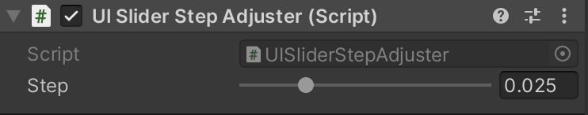

# UISliderStepAdjuster

キーボードやコントローラでSliderを操作した時の刻み値を調整する。\
マウスとボタン両方対応。

<!--# DEMO

-->


# Requirement

* UnityEngine
* UnityEngine.UI

# Usage

① 任意のSliderにコンポーネント\
② Inspectorから刻み値を調節

# Contains

## Inspector



## public Function
```
void StepSliderFix(float value)
```

# Note

刻み値を小さくしすぎると、マウスで操作した時にハンドル操作が遅れます。Inspectorから適切な値を設定してください。

<!--# License

"EntityStatus" is under [MIT license](https://en.wikipedia.org/wiki/MIT_License).-->
